# Classic Op-Amp Amplifier Configurations with Online Circuit Diagrams (LaTeX Edition)

This document is a LaTeX-equation edition of
`Op_Amp_Amplifier_Configurations_Online_Diagrams.md` and a source-linked companion
to `Op_Amp_Amplifier_Configurations.md`.
The circuit diagrams here are not hand-drawn for this report; they are downloaded
from online technical/tutorial sources into the repository so GitHub can render them
reliably. The equations and comments are written here for study and cross-checking.

> Note: The local image files are included for stable Markdown preview. For formal
> slides or a thesis/report, cite the source page under each figure and verify that
> the image license or fair-use context is appropriate.

## Main Sources Used

- Analog Devices, "ADALM1000 SMU Training Topic 17: Basic Op Amp Configurations":
  https://www.analog.com/en/resources/analog-dialogue/studentzone/studentzone-may-2019.html
- Analog Devices, "Inverting Op Amp":
  https://www.analog.com/en/resources/glossary/inverting-op-amp.html
- Analog Devices, "Optimizing Precision Photodiode Sensor Circuit Design":
  https://www.analog.com/en/resources/technical-articles/optimizing-precision-photodiode-sensor-circuit-design.html
- Electronics Tutorials, "Operational Amplifier Summary":
  https://www.electronics-tutorials.ws/opamp/opamp_8.html
- Electronics Tutorials, "Active Low Pass Filter":
  https://www.electronics-tutorials.ws/filter/filter_5.html
- Electronics Tutorials, "Sallen and Key Filter":
  https://www.electronics-tutorials.ws/filter/sallen-key-filter.html
- Electronics Tutorials, "Op-amp Comparator":
  https://www.electronics-tutorials.ws/opamp/op-amp-comparator.html
- Electronics Tutorials, "Instrumentation Amplifier":
  https://www.electronics-tutorials.ws/opamp/instrumentation-amplifier.html
- Wikimedia Commons circuit diagrams listed under each figure. These are used as
  local image assets for stable GitHub Markdown preview.
- Wikimedia Commons, "Op-Amp Logarithmic Amplifier.svg":
  https://commons.wikimedia.org/wiki/File:Op-Amp_Logarithmic_Amplifier.svg
- Wikimedia Commons, "Op-Amp Schmitt Trigger.svg":
  https://commons.wikimedia.org/wiki/File:Op-Amp_Schmitt_Trigger.svg

## Ideal Op-Amp Assumptions

For most linear negative-feedback circuits below, the first-order ideal assumptions are:

- Input currents are approximately zero: $I_+ = I_- = 0$.
- With negative feedback and no saturation, the input terminals are at nearly equal voltage: $V_+ \approx V_-$.
- Output current and voltage are limited by the actual op amp, supply rails, load, bandwidth, slew rate, input/output swing, noise, and stability.

These assumptions are useful for deriving the clean textbook equations, but real designs must check input common-mode range, output swing, gain-bandwidth product, phase margin, resistor noise, bias-current errors, and capacitive loading.

## 1. Voltage Follower / Unity-Gain Buffer

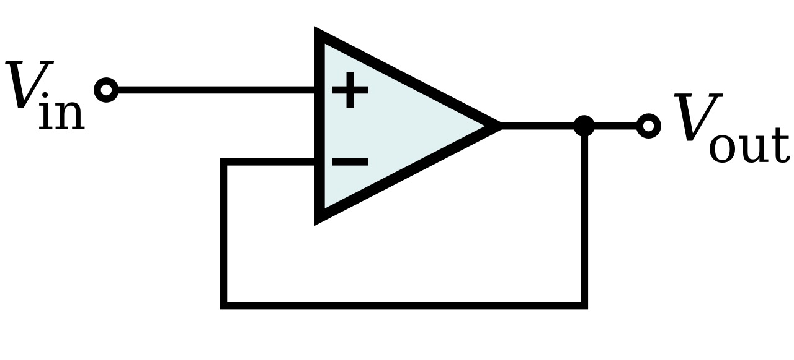

Source page: Wikimedia Commons, Op-Amp Unity-Gain Buffer.svg.
Local image file: `assets/op_amp_configurations_white/unity_gain_buffer_wikimedia_white.jpg`

Function: voltage buffering without voltage gain.

Ideal relation:

```math
V_{\mathrm{out}} = V_{\mathrm{in}}

A_v = 1
```

Analysis:

The output is fed directly to the inverting input. Negative feedback forces the op amp output to follow the non-inverting input. Its main value is impedance transformation: very high input impedance and low output impedance.

Applications:

- Buffering high-impedance sensors or voltage dividers.
- Isolating one filter stage from another.
- Driving ADC inputs or cables when no voltage gain is needed.

Practical notes:

- Check unity-gain stability; not all op amps are stable at gain of 1.
- Capacitive loads may require an output isolation resistor.

## 2. Non-Inverting Amplifier

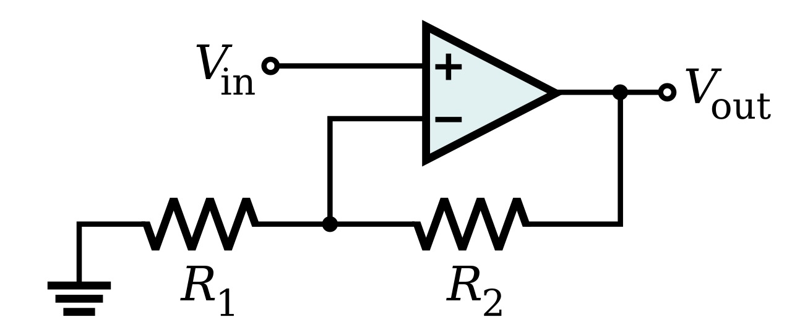

Source page: Wikimedia Commons, Op-Amp Non-Inverting Amplifier.svg.
Local image file: `assets/op_amp_configurations_white/non_inverting_amplifier_wikimedia_white.jpg`

Function: amplify a voltage without phase inversion.

Ideal relation:

```math
V_{\mathrm{out}}
=
\left(1+\frac{R_f}{R_g}\right)V_{\mathrm{in}}

A_v
=
1+\frac{R_f}{R_g}
```

Analysis:

The input drives the non-inverting terminal. The feedback divider samples
$V_{\mathrm{out}}$ and returns a fraction to the inverting terminal. Since
$V_- \approx V_+ = V_{\mathrm{in}}$, the output must rise until the feedback
divider equals $V_{\mathrm{in}}$.

Applications:

- General sensor voltage gain.
- High-input-impedance preamplifier stages.
- Offset or reference-buffered single-supply stages.

Practical notes:

- Minimum stable gain depends on the selected op amp.
- The input common-mode range must include the input signal.
- For precision gain, resistor ratio tolerance matters more than absolute resistor values.

## 3. Inverting Amplifier

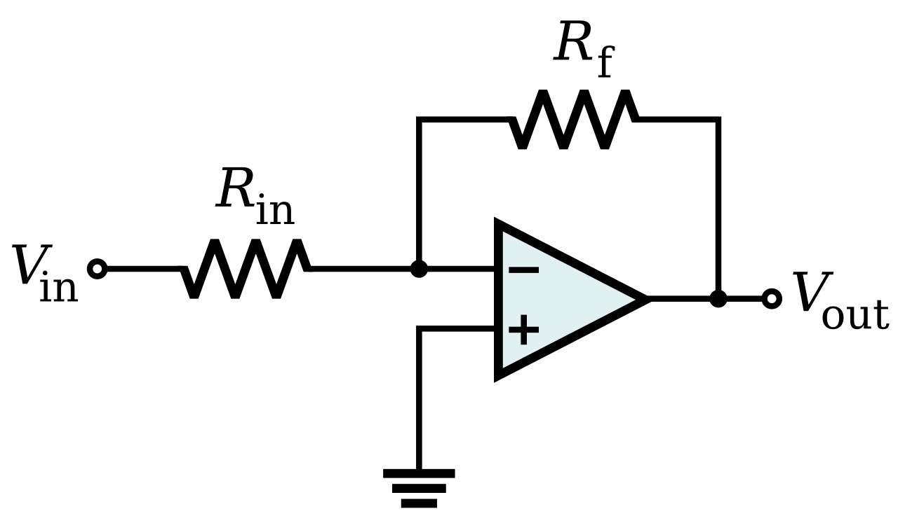

Source page: Wikimedia Commons, Op-Amp Inverting Amplifier.svg.
Local image file: `assets/op_amp_configurations_white/inverting_amplifier_wikimedia_white.jpg`

Function: amplify with 180-degree phase inversion.

Ideal relation:

```math
V_{\mathrm{out}}
=
-\frac{R_f}{R_{\mathrm{in}}}V_{\mathrm{in}}

A_v
=
-\frac{R_f}{R_{\mathrm{in}}}
```

Analysis:

With the non-inverting input grounded, the inverting node is a virtual ground.
Input current through $R_{\mathrm{in}}$ cannot enter the op amp input, so it
flows through $R_f$. The output voltage is whatever value is required to
support that feedback current.

Applications:

- Controlled-gain signal inversion.
- Current summing at a virtual-ground node.
- PI/PID error-path scaling and polarity correction.

Practical notes:

- Input impedance is approximately $R_{\mathrm{in}}$.
- Bias-current compensation may use a resistor from $V_+$ to ground approximately equal to $R_{\mathrm{in}}\parallel R_f$.

## 4. Inverting Summing Amplifier

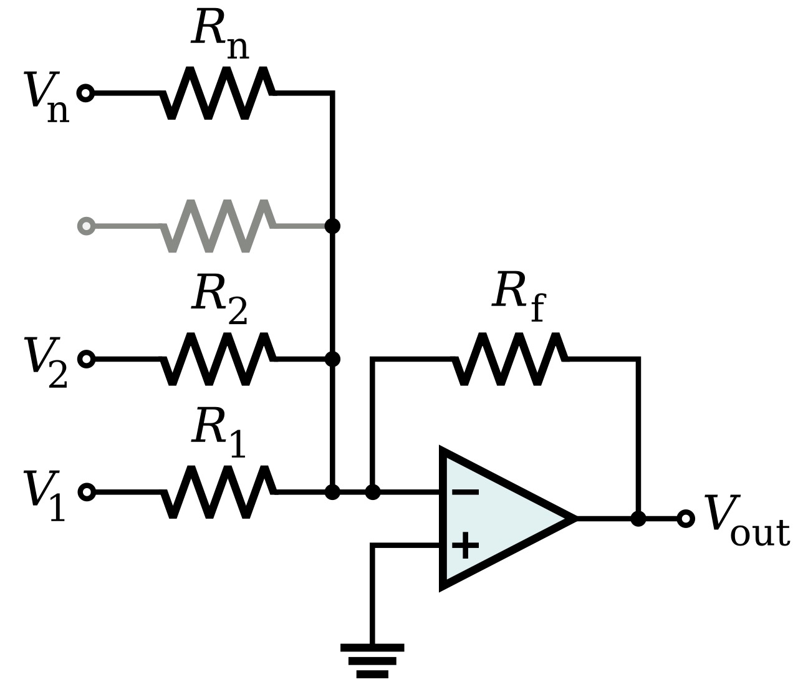

Source page: Wikimedia Commons, Op-Amp Summing Amplifier.svg.
Local image file: `assets/op_amp_configurations_white/summing_amplifier_wikimedia_white.jpg`

Function: weighted addition of several input voltages with inversion.

Ideal relation:

```math
V_{\mathrm{out}}
=
-R_f
\left(
\frac{V_1}{R_1}
+\frac{V_2}{R_2}
+\cdots
+\frac{V_n}{R_n}
\right)
```

If all input resistors are equal to $R$:

```math
V_{\mathrm{out}}
=
-\frac{R_f}{R}
\left(
V_1+V_2+\cdots+V_n
\right)
```

Analysis:

All input currents sum at the virtual-ground inverting node. Because the node voltage is nearly fixed, each input contributes independently according to its resistor value. This makes the circuit a natural analog weighted-sum block.

Applications:

- Audio mixers.
- DAC resistor networks.
- PID summing junctions combining P, I, D, offset, and feed-forward terms.

Practical notes:

- Input channels interact little ideally, but source impedance adds to each input resistor.
- Large numbers of inputs increase noise and parasitic capacitance at the summing node.

## 5. Difference Amplifier / Subtractor

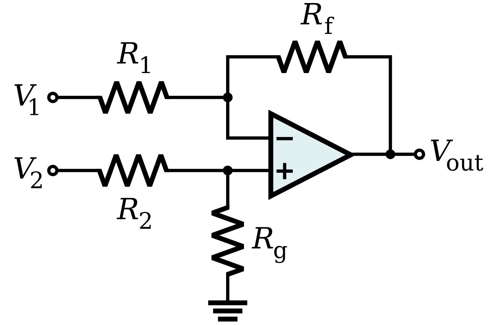

Source page: Wikimedia Commons, Op-Amp Differential Amplifier.svg.
Local image file: `assets/op_amp_configurations_white/differential_amplifier_wikimedia_white.jpg`

Function: subtract two input voltages and optionally apply gain.

Ideal relation for matched ratios $\frac{R_2}{R_1}=\frac{R_4}{R_3}$:

```math
V_{\mathrm{out}}
=
\frac{R_2}{R_1}
\left(
V_2-V_1
\right)
```

For all four resistors equal:

```math
V_{\mathrm{out}} = V_2-V_1
```

Analysis:

The circuit combines an inverting path for one input and a non-inverting divider path for the other. Accurate subtraction depends critically on resistor-ratio matching. Poor matching converts common-mode voltage into output error.

Applications:

- Differential-to-single-ended conversion.
- Bridge readout when source impedance is low and common-mode requirements are modest.
- Error-signal generation.

Practical notes:

- CMRR is often resistor-ratio limited.
- For high source impedance or high CMRR, use an instrumentation amplifier instead.

## 6. Instrumentation Amplifier

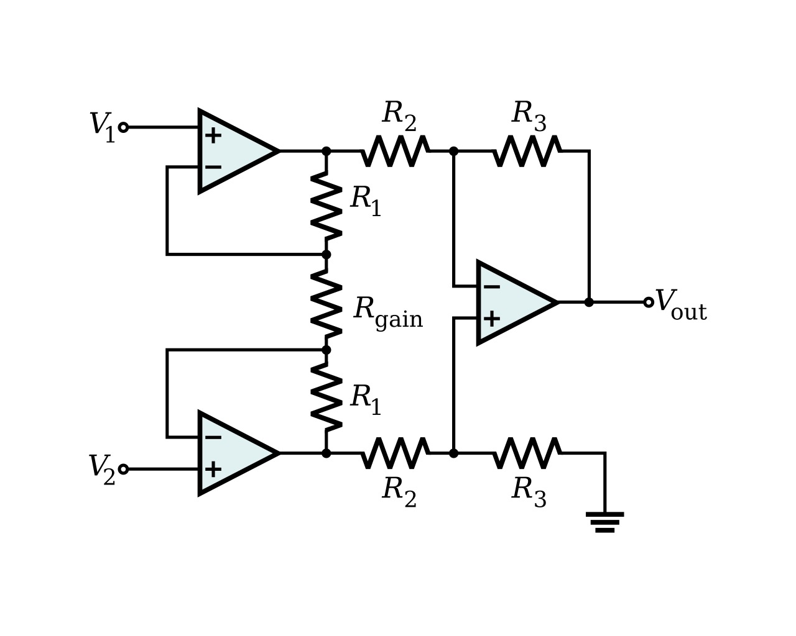

Source page: Wikimedia Commons, Op-Amp Instrumentation Amplifier.svg.
Local image file: `assets/op_amp_configurations_white/instrumentation_amplifier_wikimedia_white.jpg`

Function: high-input-impedance differential amplification with strong common-mode rejection.

Typical three-op-amp INA relation:

```math
V_{\mathrm{out}}
=
\left(
1+\frac{2R}{R_G}
\right)
\frac{R_4}{R_3}
\left(
V_2-V_1
\right)
```

For a unity-gain final difference stage:

```math
V_{\mathrm{out}}
=
\left(
1+\frac{2R}{R_G}
\right)
\left(
V_2-V_1
\right)
```

Analysis:

The first two op amps buffer and amplify each input without loading the source.
The final difference amplifier subtracts the two buffered signals. A single
gain resistor $R_G$ often controls the first-stage differential gain.

Applications:

- Wheatstone bridges.
- Strain gauges, thermocouples, biomedical electrodes.
- Precision differential measurements in noisy environments.

Practical notes:

- Use integrated INA ICs for better resistor matching and CMRR.
- Input common-mode range and output swing must be checked simultaneously.

## 7. Transimpedance Amplifier / Photodiode Amplifier

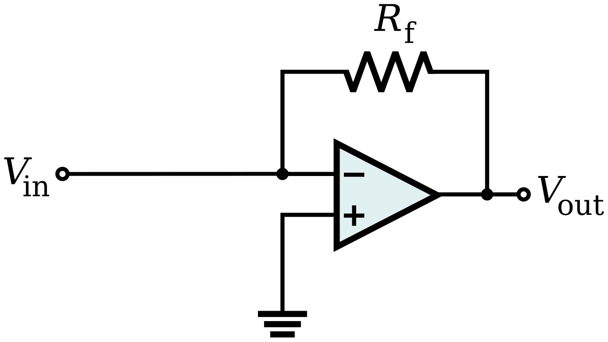

Source page: Wikimedia Commons, Transimpedance amplifier, simple.svg.
Local image file: `assets/op_amp_configurations_white/transimpedance_amplifier_wikimedia_white.jpg`

Function: convert input current to output voltage.

Ideal relation:

```math
V_{\mathrm{out}} = -I_{\mathrm{in}}R_f
```

Depending on photodiode polarity and reference choice, the sign may appear positive in a particular schematic.

Analysis:

The op amp holds the summing node near the reference voltage, so the sensor
current flows through $R_f$. A feedback capacitor is often added for stability
because photodiode capacitance and op amp input capacitance add phase shift.

Applications:

- Photodiode readout.
- Ionization chambers and low-current detectors.
- Current-output sensors.

Practical notes:

- Choose low input bias current for small currents.
- Guarding, leakage control, and PCB cleanliness can dominate precision.
- Stability must be checked with sensor capacitance included.

## 8. Inverting Integrator

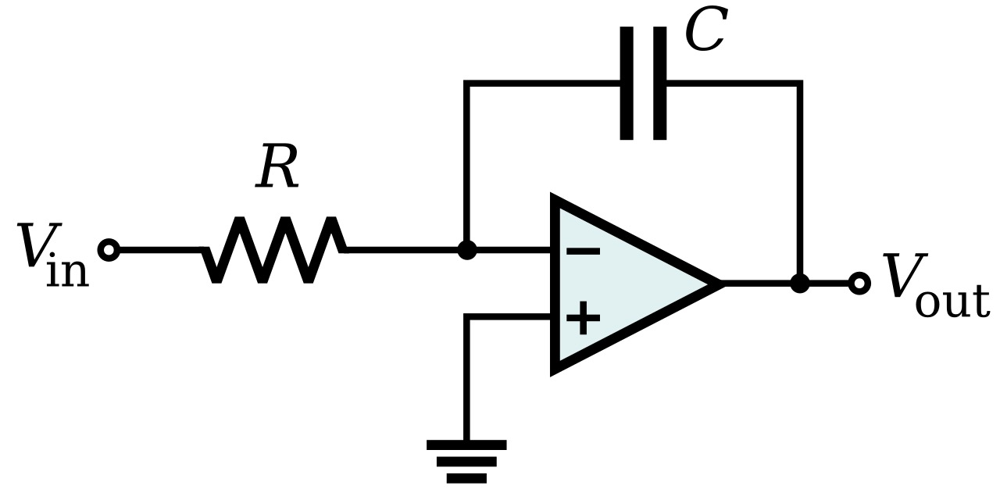

Source page: Wikimedia Commons, Op-Amp Integrating Amplifier.svg.
Local image file: `assets/op_amp_configurations_white/integrating_amplifier_wikimedia_white.jpg`

Function: output is proportional to the time integral of input voltage.

Ideal relation:

```math
V_{\mathrm{out}}(t)
=
-\frac{1}{RC}
\int_{0}^{t}V_{\mathrm{in}}(\tau)\,d\tau
+
V_{\mathrm{out}}(0)
```

```math
H(s)
=
\frac{V_{\mathrm{out}}(s)}{V_{\mathrm{in}}(s)}
=
-\frac{1}{sRC}
```

Analysis:

The input resistor converts input voltage to current. That current charges or discharges the feedback capacitor. The output ramps as needed to keep the inverting input at virtual ground.

Applications:

- PI/PID integral path.
- Ramp generation.
- Analog computation.
- Charge-sensitive amplifiers in modified form.

Practical notes:

- A real integrator usually places a large resistor in parallel with the capacitor to prevent DC saturation.
- Bias current and input offset voltage integrate over time and can drive the output to a rail.

## 9. Inverting Differentiator

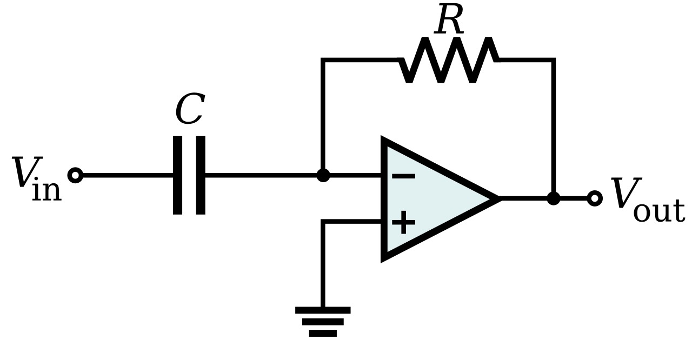

Source page: Wikimedia Commons, Op-Amp Differentiating Amplifier.svg.
Local image file: `assets/op_amp_configurations_white/differentiating_amplifier_wikimedia_white.jpg`

Function: output is proportional to the time derivative of input voltage.

Ideal relation:

```math
V_{\mathrm{out}}(t)
=
-R_fC\frac{dV_{\mathrm{in}}(t)}{dt}
```

```math
H(s) = -sR_fC
```

Analysis:

The input capacitor current is $C\,dV_{\mathrm{in}}/dt$, and this current flows
through the feedback resistor. The differentiator emphasizes fast changes and
high-frequency content.

Applications:

- Edge detection.
- Lead compensation.
- PID derivative path, usually with high-frequency roll-off.

Practical notes:

- The ideal differentiator is noise-sensitive and often unstable.
- Practical differentiators add a series input resistor and a feedback capacitor to limit high-frequency gain.

## 10. First-Order Active Low-Pass Amplifier

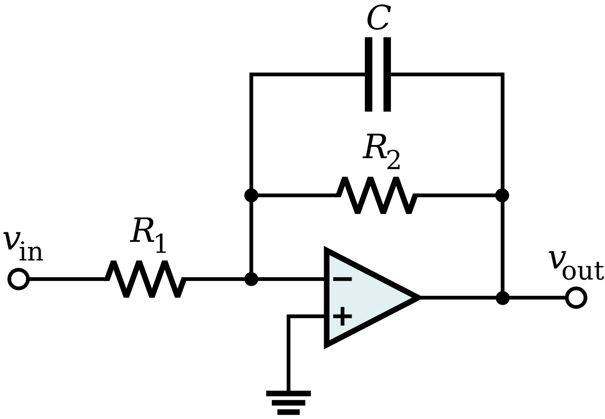

Source page: Wikimedia Commons, Active Lowpass Filter RC.svg.
Local image file: `assets/op_amp_configurations_white/active_lowpass_filter_wikimedia_white.jpg`

Function: pass low-frequency signals, attenuate high-frequency signals, and optionally provide gain.

Ideal relations:

```math
A_f = 1+\frac{R_2}{R_1}
```

```math
f_c = \frac{1}{2\pi RC}
```

```math
\left|H(f)\right|
=
\frac{A_f}
{\sqrt{1+\left(\frac{f}{f_c}\right)^2}}
```

Analysis:

The RC network sets the corner frequency. The op amp prevents load impedance from disturbing the filter and can provide non-inverting gain.

Applications:

- Anti-noise filtering.
- ADC anti-alias prefiltering when higher-order filtering is not required.
- PID derivative-noise suppression and actuator-bandwidth limiting.

Practical notes:

- Filter behavior is limited by op amp gain-bandwidth.
- For precision filters, capacitor tolerance and dielectric type matter.

## 11. Sallen-Key Active Filter

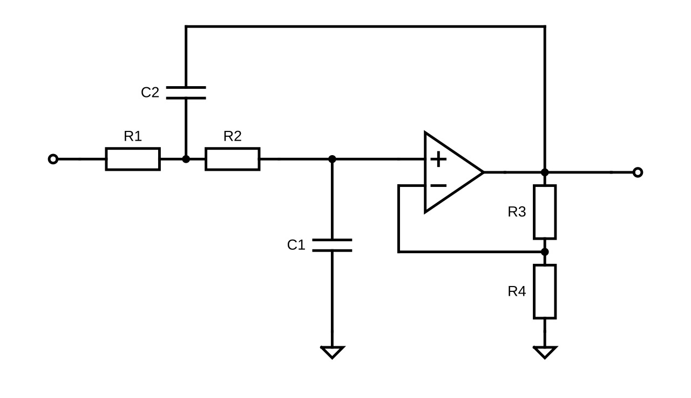

Source page: Wikimedia Commons, Sallen-Key-Filter.svg.
Local image file: `assets/op_amp_configurations_white/sallen_key_filter_wikimedia_white.jpg`

Function: second-order active filter topology; can implement low-pass, high-pass, and band-pass variants.

General second-order form:

```math
H(s)
=
\frac{K\omega_0^2}
{s^2+\frac{\omega_0}{Q}s+\omega_0^2}
\qquad
\text{(low-pass form)}
```

For equal-component unity-gain Sallen-Key low-pass, a common starting point is:

```math
f_c \approx \frac{1}{2\pi RC}
```

Analysis:

Sallen-Key uses a non-inverting op amp stage with an RC feedback network that shapes the second-order response. Its advantages are simplicity and high input impedance; its disadvantages are sensitivity to component tolerances and op amp limitations, especially at high Q.

Applications:

- Audio filters.
- Lock-in and detector signal conditioning.
- Control-loop bandwidth shaping.

Practical notes:

- High-Q designs are sensitive to resistor/capacitor tolerance.
- The op amp must have enough bandwidth and slew rate at the selected $f_c$ and gain.

## 12. Comparator-Like Op-Amp Use

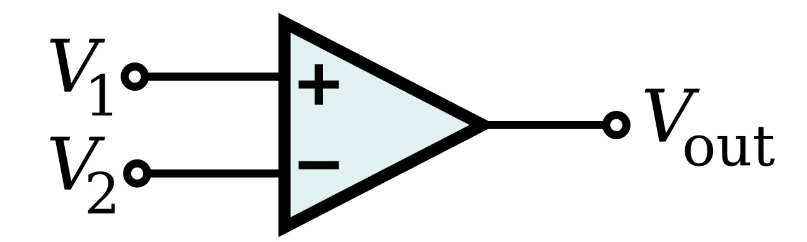

Source page: Wikimedia Commons, Op-Amp Comparator.svg.
Local image file: `assets/op_amp_configurations_white/comparator_wikimedia_white.jpg`

Function: compare an input voltage against a reference and drive the output high or low.

Ideal decision relation:

```math
V_{\mathrm{out}}
=
\begin{cases}
V_{\mathrm{sat}+}, & V_+>V_-,\\
V_{\mathrm{sat}-}, & V_+<V_-.
\end{cases}
```

Analysis:

This is open-loop operation, not linear amplification. The op amp's very high open-loop gain makes the output saturate for tiny differential input voltages.

Applications:

- Threshold detection.
- Zero-crossing detection.
- Simple square-wave generation.

Practical notes:

- A dedicated comparator is usually better than an op amp for speed, saturation recovery, and logic output compatibility.
- Slow or noisy inputs can cause output chatter unless hysteresis is added.

## 13. Schmitt Trigger / Comparator with Hysteresis

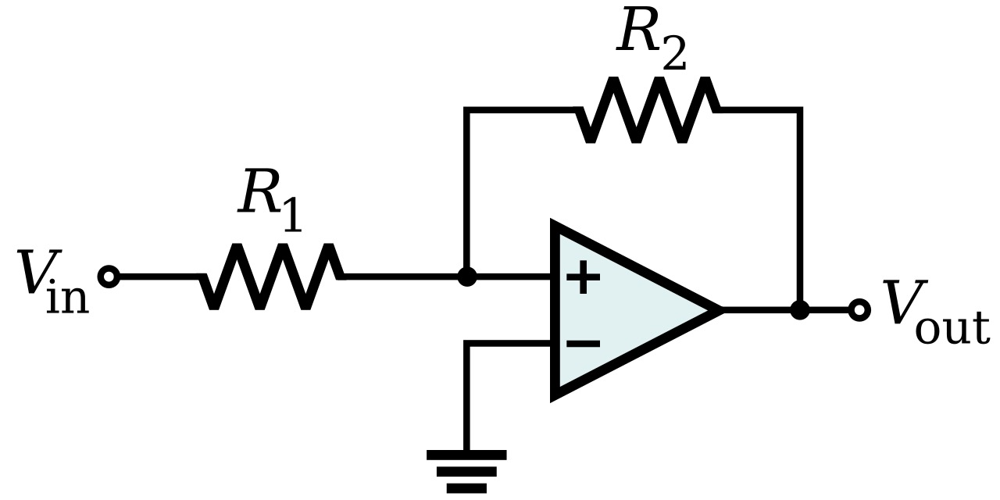

Source page: Wikimedia Commons, Op-Amp Schmitt Trigger.svg.
Local image file: `assets/op_amp_configurations_white/schmitt_trigger_wikimedia_white.jpg`

Function: comparator with two switching thresholds.

For a symmetric inverting Schmitt trigger with feedback factor $\beta$:

```math
V_{\mathrm{UT}} \approx +\beta V_{\mathrm{sat}}

V_{\mathrm{LT}} \approx -\beta V_{\mathrm{sat}}

\beta
=
\frac{R_2}{R_1+R_2}
```

The exact resistor labels in the expression for $\beta$ depend on the schematic.

Analysis:

Positive feedback makes the reference threshold depend on the output state. The input must cross a different threshold to switch back, producing hysteresis and preventing chatter.

Applications:

- Cleaning noisy digital transitions.
- Oscillators and relaxation wave generators.
- Threshold detection for slow sensor signals.

Practical notes:

- Threshold equations depend on exact resistor placement and reference voltage.
- Dedicated comparators again tend to outperform general op amps.

## 14. Logarithmic Amplifier

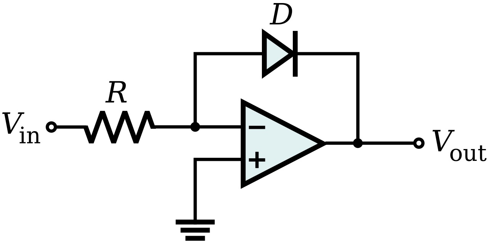

Source page: Wikimedia Commons, Op-Amp Logarithmic Amplifier.svg.
Local image file: `assets/op_amp_configurations_white/logarithmic_amplifier_wikimedia_white.jpg`

Function: produce an output approximately proportional to the logarithm of input current or voltage.

For a diode-connected feedback element:

```math
I_D
\approx
I_S
\exp\left(
\frac{V_D}{nV_T}
\right)
```

```math
V_{\mathrm{out}}
\approx
-nV_T
\ln\left(
\frac{I_{\mathrm{in}}}{I_S}
\right)
```

Analysis:

The exponential diode or transistor junction converts current ratio into voltage. A matched correction diode or transistor can reduce temperature dependence.

Applications:

- Wide-dynamic-range sensor conditioning.
- Optical power measurements.
- Compression before ADC conversion.

Practical notes:

- Temperature compensation is essential.
- Input current polarity and dynamic range must match the log element.

## 15. Precision Rectifier / Absolute-Value Amplifier

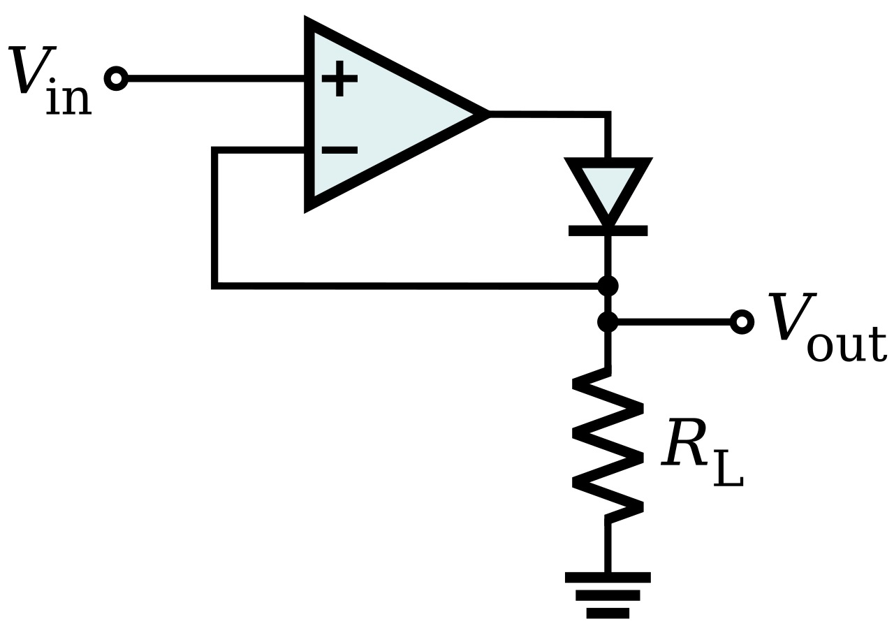

Source page: Wikimedia Commons, Op-Amp Precision Rectifier.svg.
Local image file: `assets/op_amp_configurations_white/precision_rectifier_wikimedia_white.jpg`

Full-wave version:

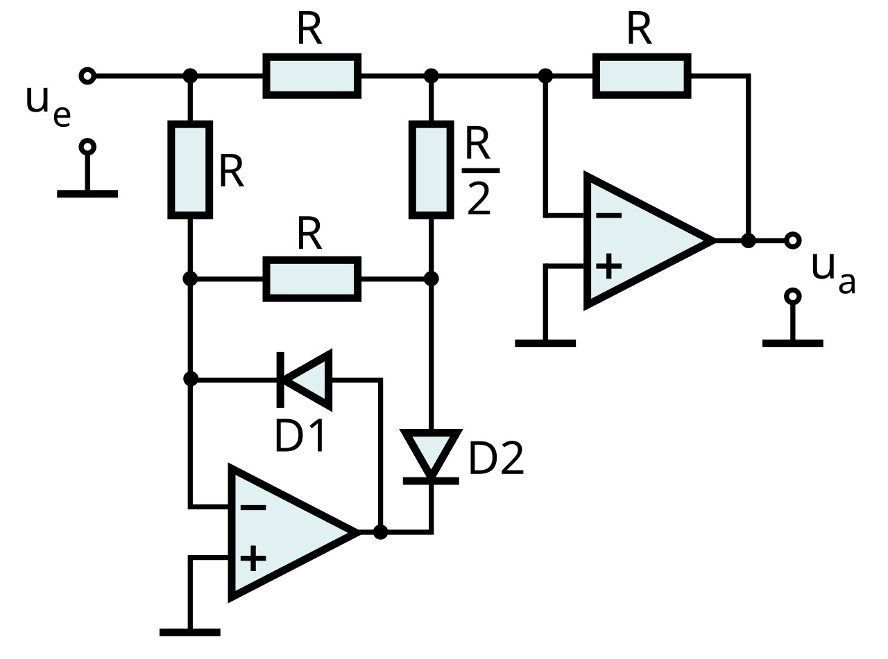

Source page: Wikimedia Commons, Op-Amp Precision Rectifier full wave.svg.
Local image file: `assets/op_amp_configurations_white/precision_rectifier_full_wave_wikimedia_white.jpg`

Function: rectify signals smaller than a diode drop by placing the diode inside the op amp feedback path.

Ideal half-wave relation:

```math
V_{\mathrm{out}}
\approx
\begin{cases}
V_{\mathrm{in}}, & \text{selected polarity},\\
0, & \text{opposite polarity}.
\end{cases}
```

Absolute-value versions combine rectified paths:

```math
V_{\mathrm{out}} \approx \left|V_{\mathrm{in}}\right|
```

Analysis:

The op amp compensates for diode forward drop by increasing its output until the feedback condition is met. This allows rectification of millivolt-level signals, unlike passive diode rectifiers.

Applications:

- Precision AC-to-DC conversion.
- Signal magnitude detection.
- Analog absolute-value blocks.

Practical notes:

- High-frequency performance is limited by op amp slew rate and diode switching.
- Full-wave circuits require careful gain matching.

## Quick Configuration Map

| Configuration | Core Function | Ideal Equation |
|---|---|---|
| Voltage follower | Buffer | $V_{\mathrm{out}}=V_{\mathrm{in}}$ |
| Non-inverting amp | Same-polarity voltage gain | $V_{\mathrm{out}}=\left(1+\frac{R_f}{R_g}\right)V_{\mathrm{in}}$ |
| Inverting amp | Inverted voltage gain | $V_{\mathrm{out}}=-\frac{R_f}{R_{\mathrm{in}}}V_{\mathrm{in}}$ |
| Inverting summer | Weighted sum | $V_{\mathrm{out}}=-R_f\sum_i\frac{V_i}{R_i}$ |
| Difference amp | Subtraction | $V_{\mathrm{out}}=\frac{R_2}{R_1}(V_2-V_1)$ |
| Instrumentation amp | Precision differential gain | $V_{\mathrm{out}}=G(V_2-V_1)$ |
| Transimpedance amp | Current-to-voltage | $V_{\mathrm{out}}=-I_{\mathrm{in}}R_f$ |
| Integrator | Time integral | $H(s)=-\frac{1}{sRC}$ |
| Differentiator | Time derivative | $H(s)=-sRC$ |
| Active low-pass | Gain plus low-pass filtering | $f_c=\frac{1}{2\pi RC}$ |
| Sallen-Key filter | Second-order filtering | $H(s)$ in second-order form |
| Comparator | Threshold decision | $V_{\mathrm{out}}\rightarrow V_{\mathrm{rail}}$ |
| Schmitt trigger | Hysteretic threshold | $V_{\mathrm{UT}}$ and $V_{\mathrm{LT}}$ set by feedback divider |
| Log amplifier | Logarithmic conversion | $V_{\mathrm{out}}\propto\ln(I_{\mathrm{in}})$ |

## What To Use for the PID v3.9 Report

For the PID circuit report, the most relevant sourced figures are:

1. Inverting amplifier: directly maps to many OP27/OP270 gain stages.
2. Inverting summing amplifier: directly maps to PID summing and output combination sections.
3. Integrator: directly maps to the I path.
4. Differentiator or practical lead/lag differentiator: conceptually maps to the D path, though the actual circuit may use filtered derivative behavior.
5. Active low-pass / feedback capacitor examples: useful for explaining noise limiting and loop stability.
6. Comparator/Schmitt trigger only if discussing lock detection, limit switching, or non-linear switching behavior.
