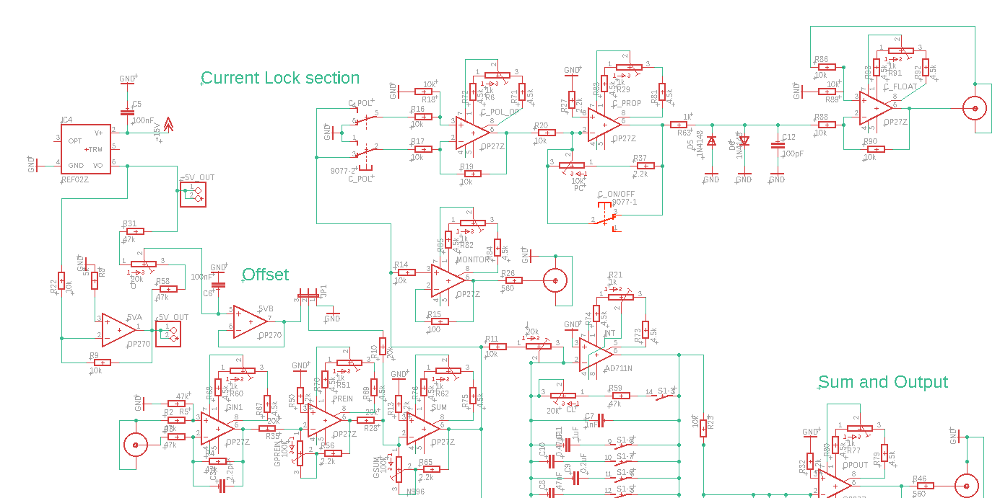
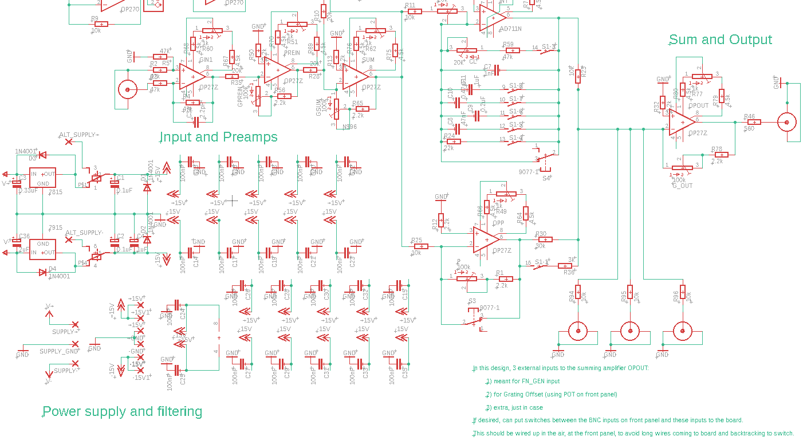

# PID v3.9 Circuit Report

**Core goal:** fully understand the PID v3.9 circuit as an analog lock module: its control theory, schematic implementation, PCB realization, NIM-box integration, external connections, and practical testing workflow.

---

## 1. Executive Summary

The PID v3.9 board is called a "PID" board by lab convention, but the README explicitly states that the implemented control electronics contain **proportional** and **integral** functions only. There is no true differential control branch. A more precise description is:

```text
analog PI lock circuit + offset/reference system + gain stages + monitor/output interfaces + NIM module integration
```

The board accepts an external experimental error signal, conditions it through input and preamplifier stages, sums it with offsets or auxiliary inputs, sends it through proportional/integrating/output stages, and delivers correction voltages to external actuators such as laser current drivers, piezo/grating drivers, or modulation inputs.

The design is not only a PCB. It is a complete NIM-format experimental control module:

- The **PCB** implements the analog topology, precision references, power regulation, and many fixed gain/filter networks.
- The **front panel** provides BNC inputs/outputs, lock switches, polarity controls, and user-facing potentiometers.
- A **separate trim-pot/daughter board** is used for some adjustment components because a single-width NIM module has tight vertical space and because the trimmers are expected to be easier to replace off-board.
- The **NIM box** provides mechanical support, shielding, and power access.
- The **external experiment** closes the loop through an actuator and an observed error signal.

The most important practical rule from the testing procedure is:

```text
Do not install the ICs before verifying the power rails and regulator outputs.
```

The intended test sequence is power first, then reference/offset, then signal stages, then lock/output sections.

---

## 2. Source Material Used

This report was assembled from the following local materials:

- Eagle schematic: `PID_GDrive/PID_V3_9.sch`
- Eagle PCB board: `PID_GDrive/PID_V3_9.brd`
- Schematic screenshots:
  - `PID_GDrive/pid39sch01.png`
  - `PID_GDrive/pid39sch02.png`
- Board/assembly images:
  - `PID_GDrive/PIDbrd3.9.png`
  - `PID_GDrive/PID 3.9.bmp`
  - `PIDv3.9withCoreComp-4.jpg`
  - rendered HEIC photo assets in `outputs/pid_report_assets/`
- Existing analysis note: `PID_Circuit_Detailed_Analysis.md`
- Parts/order spreadsheet: `PID_GDrive/PID_3_9_order REU 2013.xlsx`
- Datasheets in `PID_GDrive/`, including OP27 and related PDFs.
- Photo-extracted documentation:
  - `FAQ.txt`, photographed in `IMG_0069.HEIC`
  - `testing_procedure`, photographed in `IMG_0072.HEIC`, `IMG_0074.HEIC`, `IMG_0075.HEIC`, `IMG_0076.HEIC`
  - `README-PIDV39`, photographed in `IMG_0077.HEIC`, `IMG_0078.HEIC`
  - notes on PID board completion/revision, photographed in `IMG_0080.HEIC`, `IMG_0081.HEIC`
  - handwritten test notes, photographed in `IMG_0066.HEIC`, `IMG_0067.HEIC`, `IMG_0068.HEIC`

Where this report gives a specific numeric relationship from visible component values, it is based on the schematic and board files. Where it describes front-panel or NIM wiring, it uses the README/FAQ/testing notes plus visible photo evidence; some of those connections still require multimeter continuity verification on the physical module.

---

## 3. PID Theory and General Analog Implementation

### 3.1 Control Objective

A PID controller drives an actuator so that a measured process variable stays near a desired setpoint. In a laser-locking context:

```text
laser / cavity / spectroscopy signal
        ↓
photodiode or demodulated error signal
        ↓
analog PID / PI controller
        ↓
correction voltage
        ↓
current driver, piezo driver, grating actuator, etc.
        ↓
laser frequency changes
        ↓
error signal changes toward zero
```

The controller does not directly "know" the laser frequency. It only sees an error signal whose sign and slope encode whether the experiment is above or below the chosen lock point.

### 3.2 Ideal PID Law

In the time domain, a standard PID controller is:

```text
u(t) = Kp e(t) + Ki integral(e(t) dt) + Kd de(t)/dt
```

where:

- `e(t)` is the error signal.
- `u(t)` is the correction output.
- `Kp` is proportional gain.
- `Ki` is integral gain.
- `Kd` is derivative gain.

In the Laplace domain:

```text
U(s) / E(s) = Kp + Ki/s + Kd s
```

For this board, the implemented controller is closer to:

```text
U(s) / E(s) ≈ Kp + Ki/s
```

with additional sign, offset, filtering, gain staging, and output routing.

### 3.3 Proportional Term

The proportional term responds immediately to present error:

```text
uP(t) = Kp e(t)
```

In an op-amp circuit, proportional control is commonly implemented with an inverting or non-inverting amplifier:

```text
inverting amplifier:
Vout = -(Rf/Rin) Vin

non-inverting amplifier:
Vout = (1 + Rf/Rg) Vin
```

In a lock circuit, the sign matters as much as the magnitude. If the total loop sign is wrong, the system becomes positive feedback and runs away.

### 3.4 Integral Term

The integral term accumulates long-term error:

```text
uI(t) = Ki integral(e(t) dt)
```

A standard inverting op-amp integrator has:

```text
Vout(s) / Vin(s) = -1 / (R C s)
```

or in time-domain slope form for a constant input:

```text
dVout/dt = -Vin / (R C)
```

Increasing `R` or `C` makes the integrator slower. Decreasing them makes it faster. Switchable capacitors around an integrator are therefore a natural way to select loop time constants.

### 3.5 Derivative Term

A derivative stage would ideally implement:

```text
uD(t) = Kd de(t)/dt
```

or:

```text
Vout(s) / Vin(s) ∝ s
```

Derivative control is noise-sensitive and is often omitted in analog laser-lock electronics. The PID v3.9 README confirms that this board does **not** contain a differential branch.

### 3.6 General Analog Design Strategy

Analog lock boards are usually broken into these functional blocks:

```text
input conditioning
→ gain and polarity selection
→ offset/reference injection
→ summing amplifier
→ P path
→ I path
→ output summing / output driver
→ actuator interface
```

Important design strategies include:

- Use low-noise precision op-amps where small DC offsets matter.
- Keep the summing node mathematically simple and predictable.
- Provide user-adjustable gain and offset because each experiment has different error-signal amplitude and slope.
- Include monitor outputs so each stage can be tested without disturbing the main signal path.
- Use local power-supply decoupling at every IC.
- Provide polarity switches, because the correct feedback sign depends on the actuator and spectroscopy slope.
- Start with conservative gains and disable integral action during initial lock acquisition.

---

## 4. System-Level Architecture of PID v3.9

At the highest level, the circuit can be read as:

```text
External error / input signal
        ↓
GIN1: input and polarity / differential-style input stage
        ↓
PREIN: adjustable pre-gain
        ↓
SUM: error + offset + auxiliary inputs
        ↓
MONITOR: buffered observation output
        ↓
P / I / lock sections
        ↓
OPOUT / C_OUT / OUT
        ↓
External actuator input
```

The schematic itself labels these major regions:

- **Current Lock section**
- **Offset**
- **Input and Preamps**
- **Power supply and filtering**
- **Sum and Output**





The design also includes a schematic note near the summing/output area:

```text
In this design, 3 external inputs to the summing amplifier OPOUT:
1) meant for FN_GEN input
2) for Grating Offset (using POT on front panel)
3) extra, just in case
```

The same note recommends doing switching at the front panel rather than routing long wires to the board and back again.

---

## 5. Photo-Extracted README, FAQ, and Testing Notes

### 5.1 README-PIDV39

The README states several important design facts:

- The module is called a PID board out of habit.
- It actually has proportional and integrator parts, but no differential piece.
- PID v3.9 is derived from version 3.7; the revision did not intentionally change schematic connections.
- The v3.9 work removed most zero-ohm resistors from the v3.7 design. Two zero-ohm/wire jumpers remain, identified in the revision note as `R97` and `R40`, because replacing them with vias would require extra holes.
- Some slide-switch holes were enlarged so the component would fit without filing the pads.
- Component labels were repositioned for readability.
- Some 2.2 kOhm resistors were added on amplifier grounds to mitigate bias-current effects.
- The included Gerber files in that documentation are explicitly marked as not to be reused because value-label layers may be missing.

The README also warns that construction should proceed with all parts except ICs installed first, then power should be tested before plugging in chips.

### 5.2 FAQ

The FAQ explains several board-layout and construction choices:

- The light-green traces on the PCB artwork indicate copper connections; darker green areas indicate no copper.
- Large light-green copper regions are ground planes, intended to improve noise behavior.
- Trim pots are on a separate hand-soldered board for practical reasons:
  - saves vertical space in a single-width NIM module,
  - allows a grating-offset pot on the front panel,
  - trimmers are expected to age/fail sooner and are easier to replace off-board.
- Zero-ohm resistors are essentially wires/jumpers inherited from an earlier design.
- Non-standard resistor values can be substituted where the circuit is not critically dependent on exact values. The FAQ lists examples:

```text
3 kOhm  -> 3.3 kOhm
4.5 kOhm -> 4.7 kOhm
5 kOhm  -> 5.1 kOhm
30 kOhm -> 33 kOhm
```

- Some capacitors have three pads to support multiple lead spacings. Two pads may be shorted, so the capacitor must be installed between the independent pad and one of the shorted pads.
- BNC-style input/output footprints with three pads use the center pad as signal and the side pads as ground.

### 5.3 Testing Procedure

The testing procedure emphasizes background knowledge:

- inverting amplifier
- differential amplifier
- integrating circuit

It then lays out the board bring-up logic:

1. Before applying power, ensure there are no ICs in the sockets.
2. Verify NIM power wires and the intended `±24 V` pins.
3. Apply power and test DC power at the regulators.
4. Test the on-board switch after the regulators.
5. Remove power before installing ICs.
6. Install the correct chips in the correct sockets.
7. Note that OP270 and OP27/OP27G are not interchangeable:
   - OP27 is a single op-amp.
   - OP270 is a dual op-amp.
8. Isolate the top-left reference/offset section using jumper `JP1` between pins 1 and 2.
9. Test `REF02` +5 V and OP270-derived -5 V.
10. Check that the offset potentiometer gives the expected voltage range.
11. Test input and gain stages using a known function-generator input, e.g. a triangle wave.
12. Check GIN1, PREIN, SUM, MONITOR, lock sections, and OPOUT in sequence.

The test procedure gives specific expectations:

- GIN1 should output a triangle wave whose sign depends on the grating polarity switch.
- PREIN should be inverted from GIN1 and have variable gain, nominally between about 0.1x and 5x.
- SUM should be inverted from PREIN and have variable gain.
- After JP1 is moved to connect pins 2 and 3, the SUM stage should receive the offset signal.
- MONITOR should be exactly the same as SUM output because MONITOR is a voltage follower.
- With lock switches off, current-lock output should be ground.
- Grating-lock output should be tunable using the grating offset knob.
- Current-lock `C_PROP` gain is noted as tunable from about 0.2 to 1.2 and negative.
- Grating-lock `OPP` gain is noted as tunable from about 0.2 to 10 and negative.
- `OPOUT` has switch interactions:
  - `S1-4` can short out the integrator for initial testing.
  - `S1-1` affects signal level from OPP.
  - `S1-3` affects the time constant of INT.
  - `G_OUT` gain is about 0.2 to 10 for an individual input signal.

### 5.4 Handwritten Testing Notes

The handwritten notes document real debug observations:

- Screws were changed so the module fits properly in a NIM crate.
- A negative regulator initially did not produce the expected -15 V; replacing it with an `L7915CV` solved the issue.
- The offset potentiometer mapping was checked:

```text
pin 3 -> -5 V
pin 2 -> input B on OP270
pin 1 -> +5 V
```

- GIN1 output was observed not to be identical to input amplitude, but comparison to another box suggested the behavior might be expected.
- Grating offset problems were traced to a board connection from `GRAT_OFF` to `R94`; a small wire was added on the back of the board.
- Some output ranges differed from expectation and were later interpreted through gain settings or wiring.
- FN_GEN routing and GIN1/OUT connections were suspected/debugged.

These notes are valuable because they connect the ideal schematic to the built NIM module and show which connections may need continuity checks.

---

## 6. Schematic Section Analysis

### 6.1 Power Supply and Filtering

#### Main Components

The power section includes:

- `7815` positive regulator
- `7915` negative regulator
- `1N4001` protection diodes
- electrolytic and ceramic capacitors
- many local `100 nF` decoupling capacitors near IC power pins
- NIM/external supply pads and alternate supply pads

The typical power flow is:

```text
NIM / external supply, likely ±24 V
        ↓
7815 / 7915 linear regulators
        ↓
+15 V / -15 V analog rails
        ↓
op-amps, reference circuits, trim networks
```

The regulators prevent higher NIM supply voltages from directly powering the analog ICs. The OP27/OP270/AD711 family expects regulated bipolar supply rails, and the circuit behavior depends strongly on clean analog power.

#### Mathematical Relationship

The regulators are not signal processors, so their relevant relationship is:

```text
V+rail ≈ +15 V
V-rail ≈ -15 V
```

subject to dropout voltage, load current, thermal limits, and correct wiring.

For decoupling capacitors, the impedance decreases with frequency:

```text
ZC = 1 / (j omega C)
```

Thus each `100 nF` capacitor provides a low-impedance path for high-frequency supply noise near the IC.

#### Design Strategy

The key design strategy is distributed local decoupling. Analog op-amps can oscillate or inject noise if their supply pins see high impedance at high frequency. The many `100 nF` capacitors are not signal capacitors; they stabilize the rails locally.

#### Test Strategy

Before installing ICs:

```text
measure +15 V rail
measure -15 V rail
check GND continuity
check regulator temperature
check for rail-to-ground shorts
```

This step is mandatory because incorrect rails can destroy the op-amps and reference chips.

### 6.2 5 V Reference and Offset System

#### Main Components

The offset/reference region includes:

- `REF02Z` precision +5 V reference
- `OP270` dual op-amp
- offset potentiometer `O` (20 kOhm in schematic/BOM)
- `+5V_OUT` and `-5V_OUT` connectors
- `JP1` jumper that isolates/connects the offset section during testing

#### Function

The reference section provides stable positive and negative reference voltages used to generate adjustable offsets. The offset allows the experimental lock point to be shifted intentionally.

Conceptually:

```text
REF02: +5 V precision reference
OP270/reference network: generate -5 V or buffered references
offset pot: interpolate between +5 V and -5 V
SUM stage: inject selected DC offset into the control signal
```

#### Mathematical Relationship

If the offset pot is connected between `+5 V` and `-5 V`, and the wiper fraction is `alpha`, then:

```text
Voffset_raw = (1 - alpha)(-5 V) + alpha(+5 V)
            = -5 V + 10 alpha V
```

where `0 <= alpha <= 1`.

If the offset is then injected into an inverting summing amplifier through input resistor `Roff`, with feedback resistor `Rf`, its contribution is:

```text
Vsum_offset = -(Rf/Roff) Voffset_raw
```

The testing procedure notes that a 10 kOhm pot would give approximately `±0.5 V`, while a 20 kOhm pot gives approximately `±1 V` in that specific circuit context. This implies the usable offset range is shaped not only by the ±5 V references, but also by the surrounding resistor network.

#### Design Strategy

The reference/offset system separates two different concepts:

- **User offset:** intentionally moves the lock point.
- **Op-amp offset trim:** compensates internal input-offset voltage of precision op-amps.

This distinction matters because a user offset changes the experiment, while op-amp trim tries to remove electronic bias.

### 6.3 OP27 Offset-Null Networks

Many OP27-style op-amp symbols show a small trim network around pins 1 and 8. These are offset-null pins, not the main signal feedback path.

The purpose is:

```text
zero input difference should ideally give zero output
real op-amp input offset causes nonzero output
offset-null network injects small correction
```

This matters especially in integrator stages. A small DC input offset can integrate into a large output ramp:

```text
dVout/dt = -Voffset / (R C)
```

Even microvolt- or millivolt-scale offsets can eventually drive an integrator toward a rail.

The testing procedure notes that power-supply noise and board limitations may make perfect trimming impractical, and that the trim range might need larger trim pots or different resistor values if one wanted to improve this behavior.

### 6.4 Input Stage: GIN1

#### Main Components

The input/preamplifier section includes:

- `IN1` BNC connector
- `GIN1` OP27 op-amp
- input resistors around `47 kOhm`
- grating polarity switch interaction
- associated offset-null trim parts

#### Function

GIN1 accepts the external input signal and establishes a usable internal polarity and amplitude. The testing procedure describes it as producing either an identical or inverted triangle wave depending on the grating polarity switch setting.

This strongly suggests GIN1 is used as a polarity-selectable input conditioning stage, consistent with differential/inverting amplifier behavior.

#### Mathematical Relationship

A generic differential amplifier has:

```text
Vout = (R2/R1)(V2 - V1)
```

when resistor ratios are matched.

A generic inverting input stage has:

```text
VGIN1 = -GGIN1 Vin
```

and a non-inverting or polarity-selected path may give:

```text
VGIN1 = +GGIN1 Vin
```

The testing procedure's expected behavior can therefore be summarized as:

```text
VGIN1 ≈ ± Gin Vin
```

with sign controlled by the front-panel/schematic polarity path.

#### Design Strategy

Polarity selection is essential because a laser-lock loop must be negative feedback overall. If the actuator response or spectroscopy slope changes sign, the controller sign must be changed.

### 6.5 PREIN: Adjustable Preamp Stage

#### Main Components

The PREIN stage includes:

- `PREIN` OP27
- `GPREIN` 100 kOhm potentiometer
- associated fixed resistors and trim network

#### Function

PREIN sets the error-signal scale before summing and later PI control. The testing procedure expects:

- output inverted from GIN1,
- variable gain,
- nominal test gain set to `G = -1`,
- approximate gain range from `0.1x` to `5x`.

#### Mathematical Relationship

For an inverting variable-gain stage:

```text
VPREIN = -Gpre VGIN1
```

where:

```text
Gpre ≈ Rfeedback_effective / Rin_effective
```

The adjustable pot changes the effective feedback/input ratio.

#### Design Strategy

Different experiments produce different error-signal amplitudes. PREIN lets the user scale the error signal so later stages operate in their linear range and so the lock spectrum has a useful size.

### 6.6 SUM: Main Summing Amplifier

#### Main Components

The SUM stage includes:

- `SUM` OP27
- `GSUM` 100 kOhm potentiometer
- signal from PREIN
- offset/reference signal routed by `JP1`
- auxiliary inputs including `FN_GEN`, `GRAT_OFF`, and `SUM_IN3` in the broader summing/output system

#### Function

SUM is one of the central nodes of the board. It combines:

- processed error signal,
- user offset,
- function-generator input,
- grating offset,
- extra external input.

The testing procedure says SUM should be inverted from PREIN and have variable gain.

#### Mathematical Relationship

For an inverting summing amplifier:

```text
VSUM = -Rf ( V1/R1 + V2/R2 + V3/R3 + ... )
```

For equal input resistors:

```text
VSUM = -Gsum (Verror + Voffset + Vaux1 + Vaux2 + ...)
```

More generally:

```text
VSUM = -[ kerr VPREIN + koff Voffset + kfn VFN_GEN + kg VGRAT_OFF + kx VSUM_IN3 ]
```

where each `k` is determined by the relevant input resistor and feedback resistance.

#### Design Strategy

Using a summing amplifier gives a clean, mathematically controlled place to combine the lock error with scan, offset, and auxiliary control voltages. This is much better than physically tying voltage sources together.

### 6.7 MONITOR: Buffered Monitoring Output

#### Main Components

The MONITOR stage includes:

- `MONITOR` op-amp
- monitor BNC/connection
- buffer wiring

#### Function

The testing procedure states:

```text
MONITOR output should be exactly the same as SUM output,
since MONITOR is a voltage follower.
```

The monitor output allows scope observation without loading the internal SUM node.

#### Mathematical Relationship

For a voltage follower:

```text
VMONITOR = VSUM
```

ideally with:

```text
Zin high
Zout low
```

#### Design Strategy

The monitor stage is an observability tool. It lets the user debug the signal chain stage-by-stage.

### 6.8 INT: Integrator Stage

#### Main Components

The integrator area includes:

- `INT` AD711N op-amp
- integration potentiometer `I` (20 kOhm)
- capacitors `C7`, `C8`, `C9`, `C10`, `C11`
  - `1 nF`
  - `47 nF`
  - `0.2 uF`
  - `0.47 uF`
  - `1 uF`
- switches including `S1` sections and `S3`/`S4` interactions
- resistors such as `R23`, `R24`, `R25`, etc.

#### Function

The integrator implements the I branch of the PI controller. It accumulates the error signal and removes steady-state error.

The testing procedure says:

- `I (pot)` affects gain of INT.
- `S1-3` affects the time constant of INT.
- `S1-4` can short out the integrator for initial OPOUT testing.

#### Mathematical Relationship

For a selected capacitor `Cint` and effective input resistance `Rint`:

```text
VINT(s) / Vin(s) = -1 / (Rint Cint s)
```

For a constant DC input:

```text
dVINT/dt = -Vin / (Rint Cint)
```

The switchable capacitor bank means:

```text
Cint ∈ {1 nF, 47 nF, 0.2 uF, 0.47 uF, 1 uF, combinations depending on switch state}
```

Thus the integrator time constant is:

```text
tauI = Rint Cint
```

Larger `Cint` makes the integrator slower; smaller `Cint` makes it faster.

#### Design Strategy

Integrator speed is a stability parameter. A fast integrator can remove drift quickly, but can also cause overshoot, oscillation, or rail saturation. A slow integrator is more stable but may not correct long-term drift quickly enough.

### 6.9 P / Grating Path: OPP

#### Main Components

The grating/proportional path includes:

- `OPP` OP27
- `P` 100 kOhm potentiometer
- `PC` 10 kOhm potentiometer
- associated resistors and switch sections
- `G_OUT` 100 kOhm output gain control

#### Function

The testing procedure identifies `OPP` under the grating lock section and states:

```text
OPP gain tunable from 0.2 to 10 (negative)
```

This stage appears to be a proportional/output-conditioning branch feeding the grating/output path.

#### Mathematical Relationship

For the negative variable-gain proportional branch:

```text
VOPP = -Gopp Vin
```

with:

```text
0.2 <= Gopp <= 10
```

according to the testing procedure.

### 6.10 Current Lock Section

#### Main Components

The current-lock section includes:

- `C_POL_OP` OP27
- `C_PROP` OP27
- `C_FLOAT` OP27
- `C_ON/OFF` switch
- `C_POL` DPDT polarity switch
- `CL` 20 kOhm potentiometer
- resistors around 10 kOhm and 4.5/4.7 kOhm values
- clamp diodes and small capacitors such as `100 pF`
- `C_OUT` BNC connector

#### Function

This section routes and conditions the correction signal for a current-control actuator. In laser systems, current modulation is often faster than grating/piezo tuning but has a smaller useful range and can affect intensity as well as frequency.

The schematic names suggest:

- `C_POL_OP`: polarity processing op-amp
- `C_PROP`: proportional current-lock gain stage
- `C_FLOAT`: floating/output conditioning stage
- `C_ON/OFF`: enables or disables current lock
- `C_POL`: changes correction sign

#### Mathematical Relationship

The testing procedure gives:

```text
C_PROP gain tunable from 0.2 to 1.2, negative
```

Thus:

```text
VC_PROP ≈ -Gc Vin
```

with:

```text
0.2 <= Gc <= 1.2
```

The current-lock output can be described generically as:

```text
VC_OUT = S_on/off · S_pol · Gcurrent · Vcontrol
```

where:

- `S_on/off` is 0 or 1 depending on lock enable,
- `S_pol` is `+1` or `-1` depending on polarity,
- `Gcurrent` is the adjustable current-path gain.

#### Design Strategy

The current path needs an on/off switch and polarity control because it connects to a real actuator. Debugging should be done with current lock disabled until the signal sign and amplitude are understood.

### 6.11 Output Stage: OPOUT and OUT

#### Main Components

The output section includes:

- `OPOUT` OP27
- `G_OUT` 100 kOhm potentiometer
- `OUT` BNC connector
- `GRAT_OFF`, `FN_GEN`, and `SUM_IN3` BNC-style inputs
- output resistors such as hundreds of ohms in series
- switch interactions with `S1`

#### Function

OPOUT drives the main output/grating-lock correction path. It combines the relevant proportional/integral/offset/auxiliary signals and presents a usable correction voltage to the outside world.

The testing procedure says:

```text
G_OUT gain is 0.2 to 10 for any individual input signal.
```

The schematic note says the external summing inputs are intended for:

1. function-generator input,
2. grating offset from a front-panel pot,
3. extra input.

#### Mathematical Relationship

For the output summing stage:

```text
VOUT = -Rf ( VOPP/Ropp + VINT/Rint_path + VGRAT_OFF/Rg + VFN/Rfn + Vextra/Rx )
```

or:

```text
VOUT = -(kP VOPP + kI VINT + kG VGRAT_OFF + kF VFN_GEN + kX VSUM_IN3)
```

The output is limited by op-amp supply rails:

```text
VOUT practical range < ±15 V
```

and may be further limited by output loading and protection components.

#### Design Strategy

The output stage uses series resistance to protect the op-amp and isolate cable capacitance. Long BNC cables can look capacitive and destabilize op-amp outputs; a small series resistor improves robustness.

---

## 7. Signal Flow and Section Transitions

The functional transitions are:

```text
IN1
  → GIN1
    sign selection / input conditioning

GIN1
  → PREIN
    adjustable input scaling

PREIN
  → SUM
    combines error with offset and auxiliary sources

SUM
  → MONITOR
    buffered debug visibility

SUM / derived internal control node
  → P / OPP and INT
    immediate proportional correction and slow accumulated correction

P/I/output summing
  → OPOUT / C_OUT / OUT
    actuator-facing correction voltage
```

The loop sign is the most important global transition property. Each inverting stage flips sign, and switches may flip sign again. The correct final sign is experiment-dependent:

```text
positive experimental error
→ controller output changes actuator
→ physical system moves so error decreases
```

If the sign is wrong:

```text
positive experimental error
→ controller output changes actuator
→ physical system moves so error increases
```

which produces runaway or oscillation.

---

## 8. PCB Board to Schematic Mapping

The Eagle `.brd` file gives exact PCB element names, values, and locations. The major schematic blocks map onto the PCB approximately by named elements rather than only by physical position.

### 8.1 Key ICs

| Schematic/PCB name | Device | Role |
|---|---|---|
| `IC4` | REF02Z | precision +5 V reference |
| `5VA`, `5VB` | OP270 | reference/offset buffering and inversion |
| `GIN1` | OP27Z | input stage |
| `PREIN` | OP27Z | preamplifier gain stage |
| `SUM` | OP27Z | summing amplifier |
| `MONITOR` | OP27Z | voltage follower monitor output |
| `INT` | AD711N | integrator |
| `OPP` | OP27Z | grating/proportional stage |
| `OPOUT` | OP27Z | output summing/driver stage |
| `C_POL_OP` | OP27Z | current-lock polarity processing |
| `C_PROP` | OP27Z | current-lock proportional stage |
| `C_FLOAT` | OP27Z | current-lock output conditioning |

The BOM lists:

- 1 x `7815`
- 1 x `7915`
- 1 x `OP270`
- 9 x `OP27Z`
- 1 x `REF02Z`
- 1 x `AD711N`

This matches the schematic's emphasis on many precision single op-amp stages plus one dual OP270 and one integrator op-amp.

### 8.2 Key Pots and Trimmers

| Name | Value | Likely role |
|---|---:|---|
| `O` | 20 kOhm | offset control |
| `I` | 20 kOhm | integrator gain/time behavior |
| `P` | 100 kOhm | proportional/grating path control |
| `CL` | 20 kOhm | current-lock gain/control |
| `GPREIN` | 100 kOhm | preamp gain |
| `GSUM` | 100 kOhm | SUM gain |
| `G_OUT` | 100 kOhm | output gain |
| `PC` | 10 kOhm | proportional/current compensation path |
| `R60`, `R62`, `R6`, `R21`, `R51`, `R77`, `R82`, `R49`, `R91` | 1 kOhm trim pots | OP27 offset-null or local trim networks |

The FAQ explains why some trim pots may be mounted off-board: single-width NIM space is tight, and trim pots are easier to replace on a separate hand-soldered board.

### 8.3 Connectors and BNC-Style Pads

| Name | Function |
|---|---|
| `IN1` | main input signal |
| `ERR` | error/monitor-type BNC connection |
| `OUT` | main output |
| `C_OUT` | current-lock output |
| `GRAT_OFF` | grating offset input |
| `FN_GEN` | function-generator input |
| `SUM_IN3` | extra summing input |
| `+5V_OUT`, `-5V_OUT` | reference voltage outputs |

The FAQ states that BNC-style three-pad footprints use:

```text
center pad = signal
side pads = ground
```

This is a direct schematic-to-PCB interpretation aid.

### 8.4 Switches

| Name | Type | Function inferred from documents |
|---|---|---|
| `S1` | 8-position DIP switch | integrator/output routing/time-constant options |
| `S3`, `S4` | SPDT switches | integrator/output path options |
| `C_ON/OFF` | SPDT switch | current lock enable/disable |
| `C_POL` | DPDT switch | current lock polarity reversal |
| `U$1` / slide switch | DPDT slide switch | on-board power/supply switching |

The testing procedure specifically mentions:

```text
S1-4 shorts out integrator if desired.
S1-1 affects signal level from OPP.
S1-3 affects time constant of INT.
```

### 8.5 Board Revision Notes

The revision notes say PID v3.9 was based on v3.7 without changing the schematic connections. The changes were mostly manufacturability and readability improvements:

- removed many zero-ohm jumper resistors,
- enlarged slide-switch holes,
- repositioned labels,
- added 2.2 kOhm resistors on some amplifier grounds,
- warned not to reuse a set of Gerber files without ensuring value labels are included.

---

## 9. NIM Box, Front Panel, and External Connections

### 9.1 NIM Module Role

The NIM box is not electrically passive in the practical build. It provides:

- mechanical format for the experiment rack,
- shielding and grounding,
- front-panel mounting,
- access to standard NIM power,
- physical location for BNCs, switches, and knobs.

README notes indicate the design was made for right-handed PCB mounting rails and that a single-width NIM module is a tight fit.

### 9.2 Front Panel Controls

Based on README/FAQ/testing notes, the front panel likely includes:

- lock enable/disable switches,
- polarity switches,
- offset knobs,
- grating offset knob,
- current/grating output BNCs,
- monitor/input/function-generator BNCs.

These controls are part of the circuit's functional behavior. They are not optional user-interface decorations.

### 9.3 Off-Board Potentiometers and Daughter Board

The trim-pot/daughter-board decision is documented in the FAQ. The reasons are:

- save height/space in a single-width NIM module,
- allow important controls to live on the front panel,
- make trim pots replaceable if they fail with age,
- avoid rebuilding the full PCB for a failed trimmer.

Electrically, each off-board pot should be treated like a three-terminal component:

```text
pin 1: end A
pin 2: wiper
pin 3: end B
```

For the offset pot, handwritten notes identify:

```text
pin 3 -> -5 V
pin 2 -> OP270 input B / wiper path
pin 1 -> +5 V
```

This should still be verified on the final physical module.

### 9.4 External BNC Connections

The main external signal roles are:

```text
IN1       external error/input signal
FN_GEN    scan/modulation input
GRAT_OFF  grating offset input or front-panel pot path
SUM_IN3   spare external sum input
MONITOR   buffered SUM observation
OUT       main correction output
C_OUT     current-lock correction output
```

The schematic note warns that if switches are desired between the front-panel BNC inputs and board inputs, they should be wired at the front panel to avoid long wires running to the board and back.

### 9.5 Grounding

The README page includes a handwritten note to ground the box to the board using wires from the board GND pads to the side of the case. This is consistent with analog/NIM practice: the BNC shields, PCB ground, and chassis ground should be intentionally controlled rather than accidentally floating.

Grounding must be checked carefully, because a ground loop or floating shield can create noise, offsets, or unstable lock behavior.

---

## 10. Mathematical Summary of the Whole Circuit

The circuit can be modeled as a staged analog controller.

### 10.1 Input and Preamp

```text
VGIN1 = Sgin · Ggin · VIN
```

where:

```text
Sgin = +1 or -1 depending on polarity setting
```

Then:

```text
VPREIN = -Gpre VGIN1
```

with testing-procedure expectation:

```text
0.1 <= Gpre <= 5
```

### 10.2 Summing Node

```text
VSUM = -[ kpre VPREIN + koff Voffset + kfn VFN_GEN + kg VGRAT_OFF + kx VSUM_IN3 ]
```

For equal input resistors:

```text
VSUM = -Gsum (VPREIN + Voffset + VFN_GEN + VGRAT_OFF + VSUM_IN3)
```

### 10.3 Monitor

```text
VMONITOR = VSUM
```

### 10.4 Integrator

```text
VINT(s) = -[1 / (Rint Cint s)] VSUM(s)
```

or:

```text
dVINT/dt = -VSUM / (Rint Cint)
```

### 10.5 Proportional / Grating Branch

```text
VOPP = -Gopp VSUM
```

with testing-procedure expectation:

```text
0.2 <= Gopp <= 10
```

### 10.6 Current-Lock Branch

```text
VC_OUT = S_on/off · S_pol · Gcurrent · Vcontrol
```

where:

```text
S_on/off ∈ {0, 1}
S_pol ∈ {-1, +1}
0.2 <= Gcurrent <= 1.2
```

for the `C_PROP` gain range described in the testing procedure.

### 10.7 Main Output

```text
VOUT = -(kP VOPP + kI VINT + kG VGRAT_OFF + kF VFN_GEN + kX VSUM_IN3)
```

or as a controller approximation:

```text
VOUT(s) ≈ Aout [ Kp + Ki/s ] E(s) + offset and auxiliary terms
```

where `Aout` includes sign, output gain, and routing choices.

---

## 11. Testing Procedure and Debug Strategy

### 11.1 Power-Only Test

Before IC installation:

```text
1. Verify there are no ICs in sockets.
2. Check NIM power wiring and expected ±24 V pins.
3. Apply power.
4. Measure regulator input and output.
5. Confirm +15 V and -15 V rails.
6. Confirm switch output after regulators.
7. Check for shorts and overheating.
```

The handwritten notes show this step caught a real negative-regulator issue; replacing the regulator fixed the rail.

### 11.2 IC Installation Check

After power is correct:

```text
1. Unplug power.
2. Install ICs.
3. Verify chip identity and orientation.
4. Distinguish OP270 from OP27/OP27G.
5. Apply power again.
```

The testing procedure warns that OP270 and OP27 look similar but are not interchangeable.

### 11.3 Reference and Offset Test

With `JP1` between pins 1 and 2:

```text
1. Check REF02 +5 V.
2. Check OP270-derived -5 V.
3. Check +5 V and -5 V output points.
4. Rotate offset pot and confirm smooth expected range.
5. Check voltage-follower output tracks offset pot.
```

Then move `JP1` to pins 2 and 3 to connect offset into SUM.

### 11.4 Stage-by-Stage Signal Test

Use a function generator as known input. The testing procedure suggests a triangle wave, for example:

```text
VIN = ±1 V triangle wave
```

Then check:

```text
GIN1:
  identical or inverted triangle depending on polarity switch

PREIN:
  inverted from GIN1
  gain adjustable, temporarily set to G = -1

SUM:
  inverted from PREIN
  gain adjustable
  offset contribution visible after JP1 is moved

MONITOR:
  identical to SUM
```

### 11.5 Lock Section Test

With front-panel lock switches off:

```text
Current lock output after C_FLOAT should be GND.
Grating lock output after OPOUT should be tunable by grating offset knob.
```

Then test:

```text
C_PROP:
  gain about 0.2 to 1.2, negative

OPP:
  gain about 0.2 to 10, negative

OPOUT:
  S1-4 can bypass/short integrator for initial output testing
  S1-1 affects OPP signal level
  S1-3 affects INT time constant
  G_OUT gain about 0.2 to 10
```

### 11.6 Practical Troubleshooting Table

| Symptom | Likely cause |
|---|---|
| no output at all | no power, wrong IC, bad socket, disconnected BNC, missing front-panel wiring |
| output railed at +15 V or -15 V | excessive gain, wrong polarity, offset too large, broken feedback path |
| integrator ramps with no intentional input | input offset, leakage, switch state, op-amp trim issue |
| MONITOR correct but OUT wrong | issue after SUM, likely OPP/INT/OPOUT/routing |
| offset knob has no effect | offset pot wiring, JP1 position, broken trace to SUM, reference failure |
| grating offset knob does not affect output | broken `GRAT_OFF` path, `R94`/related connection issue, front-panel wiring |
| current lock runaway | wrong current polarity or gain too high |
| oscillation with actuator connected | loop gain too high, wrong time constant, cable capacitance, poor decoupling |
| high noise | grounding/shielding problem, long front-panel wires, poor rail filtering |

---

## 12. Known Issues and Verification Items

The documents and handwritten notes point to several known or likely verification tasks:

1. Confirm all NIM power pins and regulator outputs.
2. Confirm board ground to NIM case ground.
3. Verify `JP1` positions and offset routing.
4. Verify the offset pot pinout and voltage range.
5. Verify `GRAT_OFF` continuity, especially around `R94`, because handwritten notes mention a repaired connection.
6. Verify BNC center/shell connections for `IN1`, `FN_GEN`, `GRAT_OFF`, `SUM_IN3`, `OUT`, `C_OUT`, and monitor/error outputs.
7. Verify all front-panel switches map to the intended schematic switch names.
8. Verify the actual installed values for non-standard resistors, especially where FAQ substitution rules were used.
9. Verify capacitor placement where three-pad capacitor footprints are used.
10. Verify that all OP27/OP270/AD711/REF02 chips are in the correct sockets.

---

## 13. Interpretation: What the Board Is Doing Physically

In a real laser-lock setup, the board performs the following physical operation:

```text
1. The experiment produces an error signal.
2. GIN1/PREIN scale and sign-correct that error.
3. SUM adds intentional lock-point offsets and scan/modulation inputs.
4. MONITOR lets the user see the internal lock signal.
5. P/OPP gives immediate correction.
6. INT slowly accumulates persistent error to remove DC drift.
7. Current and grating output stages route correction to fast/small-range and slow/large-range actuators.
8. The actuator changes the laser or cavity state.
9. The error signal moves toward zero.
```

The board is therefore best understood as a **field-adjustable analog PI controller for optical locking**, packaged as a NIM module.

---

## 14. Suggested Report-to-Slides Spine

When this report is converted into slides later, the natural slide spine is:

1. What the PID v3.9 board is and is not
2. General PID/PI theory
3. System-level signal flow
4. Original schematic map
5. Power/reference/offset section
6. Input, PREIN, SUM, MONITOR sections
7. Integrator and proportional/grating path
8. Current lock and output routing
9. PCB-to-schematic mapping
10. NIM/front-panel/external connection mapping
11. Testing procedure
12. Known issues and next verification steps

---

## 15. Conclusion

PID v3.9 is a practical analog PI lock board rather than a textbook full PID controller. Its design priorities are experimental flexibility, adjustable gain/offset, polarity control, monitorability, and NIM-module usability. The schematic implements the core analog math through familiar op-amp blocks: inverting gain stages, summing amplifiers, buffers, and an integrator. The PCB and NIM implementation add important real-world details: ground planes, off-board trim pots, switch wiring, BNC footprints, regulator bring-up, and front-panel routing.

The essential understanding is:

```text
The schematic explains the mathematical controller.
The PCB explains how that controller is physically realized.
The NIM/front panel explains how the experimenter actually uses it.
The testing procedure explains how to avoid destroying it and how to debug it stage by stage.
```

For future work, the most valuable next step is to create a physical continuity/wiring table that maps every front-panel control and BNC connector back to its exact PCB net and schematic section.

